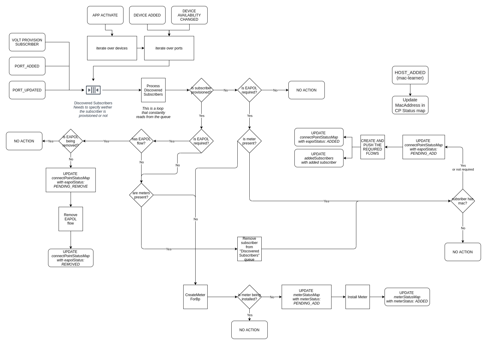

# org.opencord.org

This ONOS applications is responsible to configure the flows
required to manage an OLT Device as reported by VOLTHA.

## Configuration

The `org.opencord.olt` application depends on `org.opencord.sadis` and exposes 
the following configuration:

```shell
karaf@root > cfg get org.opencord.olt.impl.Olt                                                20:35:51
org.opencord.olt.impl.Olt
    name=defaultBpId, type=string, value=Default, defaultValue=Default, description=Default bandwidth profile id that is used for authentication trap flows.
    name=multicastServiceName, type=string, value=MC, defaultValue=MC, description=Default multicast service name.

karaf@root > cfg get org.opencord.olt.impl.OltFlowService                                                                                                                                            20:36:05
org.opencord.olt.impl.OltFlowService
    name=enableDhcpOnNni, type=boolean, value=true, defaultValue=false, description=Create DHCP trap flow on NNI port(s).
    name=enablePppoe, type=boolean, value=false, defaultValue=false, description=Send PPPoED authentication trap flows before subscriber provisioning.
    name=defaultTechProfileId, type=integer, value=64, defaultValue=64, description=Default technology profile id that is used for authentication trap flows.
    name=enableIgmpOnNni, type=boolean, value=false, defaultValue=false, description=Create IGMP trap flow on NNI port(s).
    name=enableEapol, type=boolean, value=true, defaultValue=true, description=Send EAPOL authentication trap flows before subscriber provisioning.
    name=enableDhcpV6, type=boolean, value=false, defaultValue=false, description=Enable flows for DHCP v6 if dhcp is required in sadis config.
    name=enableDhcpV4, type=boolean, value=true, defaultValue=true, description=Enable flows for DHCP v4 if dhcp is required in sadis config.

karaf@root > cfg get org.opencord.olt.impl.OltMeterService                                                                                                                                           20:36:13
org.opencord.olt.impl.OltMeterService
    name=deleteMeters, type=boolean, value=true, defaultValue=true, description=Delete meters when reference count drops to zero.

```

## CLI commands

```text
karaf@root > volt-                                                                                                                                                                                   00:29:19
volt-add-subscriber-access                                                           (Adds a subscriber to an access device)
volt-bpmeter-mappings         (Shows information about programmed meters, including the relation with the Bandwidth Profile)
volt-failed-subscribers                                                         (Shows subscribers that failed provisioning)
volt-olts                                                                                    (Shows vOLTs connected to ONOS)
volt-port-status                                    (Shows information about the OLT ports (default EAPOL, subscriber flows)
volt-programmed-meters        (Shows information about programmed meters, including the relation with the Bandwidth Profile)
volt-programmed-subscribers                                                  (Shows subscribers programmed in the dataplane)
volt-remove-subscriber-access                                                        (Adds a subscriber to an access device)
volt-requested-subscribers (Shows subscribers programmed by the operator. Their data-plane status depends on the ONU status)

```

## App Design

The `org.opencord.olt` application internal structure reflects the following diagram:

